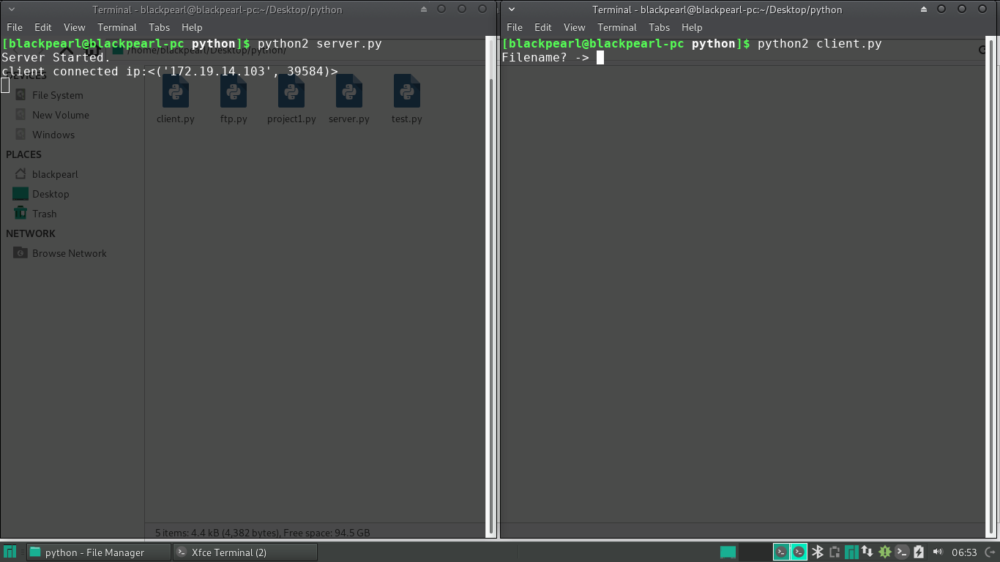

# Step To Use

First download both the file [server.py](server.py) and [client.py](client.py).

Open the terminal in first computer(File Sender) from where other computer want to get file and run the command `$python2 server.py`.
In other computer(File Receiver) which is on same network open the terminal and run the command `$python2 client.py`.

Now enter the file name you want.

